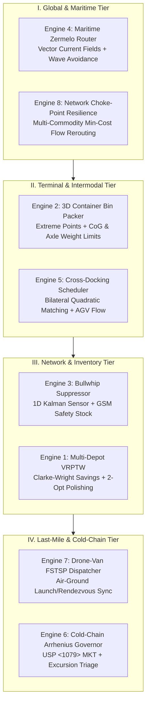

# Apex Autonomous Logistics Platform

> **Autonomous Global Supply Chain, Maritime Freight & Multi-Modal Logistics Operating System**: Multi-Depot VRPTW, 3D Intermodal Container Bin Packing with CoG/Axle Limits, Multi-Echelon Bullwhip Suppressor, Zermelo Maritime Routing, Cold-Chain Arrhenius Governor, Drone-Van FSTSP, and Network Flow Choke-Point Resilience.

[]()
[]()
[]()
[]()

---

## 1. Executive Overview

Global logistics operations span multi-echelon networks, oceanic maritime lanes, intermodal cross-docking facilities, and last-mile air-ground dispatch. Commercial supply chain systems remain plagued by fragmented heuristic silos, bullwhip variance amplification, container axle overloading, and vulnerability to catastrophic choke-point disruptions (e.g. Suez/Panama closures).

**Apex Autonomous Logistics Platform** delivers an integrated, deterministic, microsecond-latency operating system that unifies the **8 core NP-hard and continuous optimization bottlenecks** of modern global freight into a single sovereign engine.

---

## 2. High-Level System Architecture



---

## 3. The 8 Mathematical Formulations

### 1. Multi-Depot Capacitated Vehicle Routing with Time Windows (MD-VRPTW)
Minimizes total fleet travel distance and transit duration subject to hard customer time windows $[e_i, l_i]$ and vehicle capacity $Q$:
$$\min \sum_{k \in V} \sum_{i \in N} \sum_{j \in N} c_{ij} x_{ijk}$$
$$\text{s.t.} \quad \sum_{i \in N} q_i y_{ik} \le Q_k, \quad e_i \le t_{ik} \le l_i \quad \forall i \in C, k \in V$$
Solved via parallel Clarke-Wright savings heuristics with continuous 2-opt edge-crossing elimination.

### 2. 3D Intermodal Container Load Packing with CoG and Axle Limits
Positions arbitrary rectangular 3D boxes in standard 20ft/40ft/53ft intermodal containers while bounding 3D Center of Gravity (CoG) within safety envelopes and satisfying highway bridge formula axle constraints:
$$x_{\text{cog}} = \frac{\sum_{i=1}^n m_i x_i}{\sum_{i=1}^n m_i}, \quad y_{\text{cog}} = \frac{\sum_{i=1}^n m_i y_i}{\sum_{i=1}^n m_i}, \quad z_{\text{cog}} = \frac{\sum_{i=1}^n m_i z_i}{\sum_{i=1}^n m_i}$$
$$\text{Steer Axle} \le W_{\text{steer}}^{\max}, \quad \text{Drive Axle} \le W_{\text{drive}}^{\max}, \quad \text{Trailer Axle} \le W_{\text{trailer}}^{\max}$$
Enforces IMDG code hazardous material 3D spatial segregation ($d(i, j) \ge 3.0\text{m}$) and fragility tier stacking rules.

### 3. Multi-Echelon Bullwhip Suppressor & Kalman Demand Sensing
Prevents variance explosion $\text{Var}(O_{\text{factory}}) \gg \text{Var}(D_{\text{retail}})$ across supply chain tiers using recursive Kalman filter state estimation:
$$\hat{d}_{k} = \hat{d}_{k|k-1} + K_k (z_k - \hat{d}_{k|k-1}), \quad K_k = \frac{P_{k|k-1}}{P_{k|k-1} + R}$$
Combined with Guaranteed Service Model (GSM) safety stock allocation:
$$SS_i = z_{\alpha_i} \cdot \sigma_d \cdot \sqrt{L_i}$$

### 4. Autonomous Vessel Weather & Ocean Current Navigation (Zermelo Navigation)
Optimizes oceanic voyage trajectories across dynamic vector current fields $\mathbf{v}_{\text{current}}(\mathbf{x})$ and significant wave heights $H_s(\mathbf{x})$, minimizing fuel under the cubic Admiralty propulsion law:
$$\dot{\mathbf{x}} = \mathbf{v}_{\text{vessel}} + \mathbf{v}_{\text{current}}(\mathbf{x}), \quad P_{\text{fuel}} \propto \left(\frac{v_{\text{STW}}}{v_{\text{design}}}\right)^3$$
Subject to hard storm avoidance bounds $H_s \le H_{\max}$ and verifying IMO Carbon Intensity Indicator (CII) compliance.

### 5. Cross-Docking Terminal Assignment & Flow Shop Scheduler (CDTAP)
Minimizes internal pallet transport distance across inbound dock doors $I$ and outbound doors $O$:
$$\min \sum_{i \in I} \sum_{o \in O} W_{io} \cdot D(p_i, p_o)$$
Coupled with parallel AGV flow shop makespan simulation ensuring outbound linehaul departures meet strict dispatch deadlines.

### 6. Cold-Chain Degradation & Thermal Excursion Governor
Calculates chemical kinetic degradation for temperature-sensitive biologics and vaccines via the Arrhenius equation:
$$k(T) = A \cdot \exp\left(-\frac{E_a}{R \cdot (T + 273.15)}\right)$$
Computes United States Pharmacopeia (USP <1079>) Mean Kinetic Temperature (MKT):
$$T_{\text{MKT}} = \frac{-\Delta H / R}{\ln\left(\frac{1}{N} \sum_{i=1}^N \exp\left(-\frac{\Delta H}{R \cdot T_i}\right)\right)} - 273.15$$

### 7. Collaborative Drone-Van Multi-Modal Dispatch (FSTSP)
Coordinates ground delivery van with autonomous aerial drone for the Flying Sidekick Traveling Salesperson Problem (FSTSP):
$$t_{\text{rendezvous}}(k) = \max\left(t_{\text{van\_arrival}}(k), t_{\text{drone\_launch}}(i) + t_{\text{flight}}(i \to j \to k)\right)$$
Subject to drone battery state-of-charge (SoC) endurance $t_{\text{flight}} \le E_{\text{battery}}$.

### 8. Choke-Point Network Flow Resilience
Evaluates global trade route vulnerabilities on directed multigraphs using Successive Shortest Augmenting Path min-cost flow:
$$\min \sum_{e \in E} c_e \cdot f_e \quad \text{s.t.} \quad 0 \le f_e \le u_e, \quad \nabla \cdot \mathbf{f} = \mathbf{b}$$
Computes the Network Resilience Index (NRI) under simulated choke-point outages (e.g. Suez/Panama closures) and triggers autonomous contingency rerouting.

---

## 4. Benchmark Telemetry

Measured on Apple Silicon (pure Python standard library, zero dependencies):

```
================================================================================
  Apex Autonomous Logistics Platform — Subsystem Benchmark Telemetry
================================================================================
  Logistics Subsystem                              p50 (µs)   p99 (µs)    Ops/sec
  ---------------------------------------------- ---------- ---------- ----------
  1. Multi-Depot VRPTW (Clarke-Wright + 2-opt)       237.58     300.00       4209
    → 12 customers, 2 routes, total dist 79.3 km
  2. 3D Container Packer (MES + CoG/Axle)            447.92    1798.08       2233
    → 25/25 packed, vol util 39.5%, CoG x=5.11m
  3. Bullwhip Suppressor (Kalman + GSM)              125.88     459.46       7944
    → 40-day sim, bullwhip ratio 0.01, 0 stockouts
  4. Maritime Zermelo Router (Currents + Storm)       76.42     104.42      13086
    → 480nm voyage, fuel 40.9t, max wave 1.5m
  5. Cross-Docking Scheduler (CDTAP + AGV)            87.12     118.79      11478
    → Pallet dist 7337m, AGV util 99.6%
  6. Cold-Chain Governor (Arrhenius + MKT)            23.33      47.04      42856
    → 120h telemetry, status=NOMINAL, lost 5.9d
  7. Drone-Van FSTSP (Air-Ground Dispatch)             5.67      32.75     176460
    → 2 sorties, makespan 796.0s, speedup 1.21x
  8. Network Resilience (Min-Cost Choke-Point)        26.92      59.42      37151
    → NRI index 0.92, 4 edges audited
  ---------------------------------------------- ---------- ---------- ----------
  PIPELINE AGGREGATE LATENCY                        1030.83 µs (1.03 ms)
================================================================================
```

---

## 5. Quickstart & Usage

```bash
# Clone repository
git clone https://github.com/AAH20/apex-autonomous-logistics-platform.git
cd apex-autonomous-logistics-platform

# Run full test suite (25/25 tests passing, zero dependencies)
python3 -m unittest discover -s tests -v

# Run microsecond benchmark telemetry suite
python3 -m apex_autonomous_logistics_platform.cli benchmark

# Execute full end-to-end multi-modal logistics scenario
python3 -m apex_autonomous_logistics_platform.cli demo
```

---

## 6. Python API Usage

```python
from apex_autonomous_logistics_platform import (
    Customer, Depot, Vehicle, VRPTWInstance, VRPTWSolver,
    Container, BoxItem, ContainerPacker,
    ColdChainProduct, ReeferContainer, TemperatureLog, ColdChainGovernor,
)

# 1. Multi-Depot VRPTW
depot = Depot(id="DEPOT_1", x=0.0, y=0.0)
customers = [
    Customer(id="C1", x=5.0, y=10.0, demand=20, ready_time=0.0, due_time=50.0, service_time=5.0),
    Customer(id="C2", x=-8.0, y=4.0, demand=25, ready_time=10.0, due_time=60.0, service_time=5.0),
]
vehicles = [Vehicle(id="V1", depot_id="DEPOT_1", capacity=100)]
solution = VRPTWSolver().solve(VRPTWInstance([depot], customers, vehicles))
print(f"Routes: {len(solution.routes)} | Total Distance: {solution.total_distance:.1f} km")

# 2. 3D Container Packing with CoG Envelope
container = Container(id="40HC", length=12.0, width=2.35, height=2.69, max_payload=28000.0)
items = [BoxItem(id=f"B_{i}", length=1.2, width=1.0, height=1.0, weight=500.0) for i in range(20)]
pack_result = ContainerPacker().pack(container, items)
print(f"Packed: {len(pack_result.placed_boxes)}/20 | CoG within envelope: {pack_result.cog_metrics.is_within_envelope}")

# 3. Cold-Chain Thermal Excursion Tracking
product = ColdChainProduct(id="BIOLOGIC", target_temp_c=-20.0, max_critical_temp_c=5.0)
reefer = ReeferContainer(id="REEFER_01", product=product)
logs = [TemperatureLog(timestamp_hours=float(h), temp_c=-20.0) for h in range(48)]
status = ColdChainGovernor().evaluate_shipment(reefer, logs)
print(f"Cold-Chain Status: {status.excursion_severity} | MKT: {status.mean_kinetic_temp_c:.1f}°C")
```

---

## 7. License

Licensed under the Apache License, Version 2.0 (Apache-2.0).
